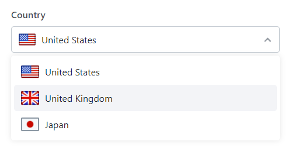

# Dynamic Select with Images

A simple and easy-to-use dynamic select with images using HTML and JavaScript. This project allows you to create a dynamic select dropdown that displays images alongside the options, enhancing user experience and adding a visual touch to dropdown menus.

The complete guide and reference is available here: [https://codeshack.io/multi-select-dropdown-html-javascript/](https://codeshack.io/dynamic-select-images-html-javascript/)

## Features

- Dynamic select dropdown with images
- Customizable placeholder text
- Multiple columns for dropdown options
- Custom HTML content for options
- Easy integration with existing forms
- Lightweight and fast

## Screenshot



## Quick Start

1. Download the latest stable version from the releases section.

2. Include the necessary CSS and JavaScript files in your project:
    ```html
    <link href="DynamicSelect.css" rel="stylesheet" type="text/css">
    <script src="DynamicSelect.js"></script>
    ```

3. Initialize the dynamic select element in your HTML file:
    ```html
    <select id="dynamic-select" name="example-select" data-placeholder="Select an option" data-dynamic-select>
        <option value="1" data-img="path/to/image1.jpg">Option 1</option>
        <option value="2" data-img="path/to/image2.jpg">Option 2</option>
        <option value="3" data-img="path/to/image3.jpg">Option 3</option>
    </select>
    ```

4. **Optional**: Initialize the dynamic select with JavaScript:
    ```javascript
    new DynamicSelect('#dynamic-select', {
        width: '200px',
        height: '40px',
        columns: 1,
        placeholder: 'Select an option',
        onChange: function(value, text, option) {
            console.log(value, text, option);
        }
    });
    ```

## Usage

### Basic Example

To use this dynamic select with images in your project, follow these steps:

1. **Include the necessary HTML structure:**
    ```html
    <select id="dynamic-select">
        <option value="1" data-img="path/to/image1.jpg">Option 1</option>
        <option value="2" data-img="path/to/image2.jpg">Option 2</option>
        <option value="3" data-img="path/to/image3.jpg">Option 3</option>
    </select>
    ```

2. **Initialize the dynamic select with JavaScript:**
    ```javascript
    new DynamicSelect('#dynamic-select', {
        placeholder: 'Select an option',
        tabindex: 0,
        columns: 1,
        width: '300px',
        height: '40px',
        data: [
            { value: '1', text: 'Option 1', img: 'path/to/image1.jpg' },
            { value: '2', text: 'Option 2', img: 'path/to/image2.jpg' },
            { value: '3', text: 'Option 3', img: 'path/to/image3.jpg' }
        ],
        onChange: function(value, text, option) {
            console.log(value, text, option);
        }
    });
    ```

### Advanced Example with Custom HTML Content + Bootstrap CSS

You can also use custom HTML content for the options:

```html
<select id="custom-select">
    <option value="1">Option 1</option>
    <option value="2">Option 2</option>
    <option value="3">Option 3</option>
</select>
```

```javascript
new DynamicSelect('#custom-select', {
    bootstrapForm: true, // Requires Bootstrap5 library
    placeholder: 'Select an option',
    data: [
        { value: '1', html: '<span>Option 1</span>' },
        { value: '2', html: '<span>Option 2</span>' },
        { value: '3', html: '<span>Option 3</span>' }
    ],
    onChange: function(value, text, option) {
        console.log(value, text, option);
    }
});
```

### Example with Multiple Columns

For dropdown options to be displayed in multiple columns:

```html
<select id="multi-column-select"></select>
```

```javascript
new DynamicSelect('#multi-column-select', {
    columns: 3,
    height: '100px',
    width: '160px',
    dropdownWidth: '400px',
    placeholder: 'Select a photo',
    data: [
        { value: '1', img: 'path/to/image1.jpg', imgWidth: '100px', imgHeight: '80px' },
        { value: '2', img: 'path/to/image2.jpg', imgWidth: '100px', imgHeight: '80px' },
        { value: '3', img: 'path/to/image3.jpg', imgWidth: '100px', imgHeight: '80px' },
        { value: '4', img: 'path/to/image4.jpg', imgWidth: '100px', imgHeight: '80px' },
        { value: '5', img: 'path/to/image5.jpg', imgWidth: '100px', imgHeight: '80px' },
        { value: '6', img: 'path/to/image6.jpg', imgWidth: '100px', imgHeight: '80px' }
    ],
    onChange: function(value, text, option) {
        console.log(value, text, option);
    }
});
```

It is useful if you want to populate images in a grid-like view.

## Configuration

To customize the dynamic select with images, you can modify the HTML and JavaScript as needed. The following options are available:

- `placeholder`: Placeholder text for the select element.
- `columns`: Number of columns in the dropdown.
- `name`: Name attribute for the select element.
- `width`: Width of the select element.
- `height`: Height of the select element.
- `data`: Array of objects representing the select options.
- `onChange`: Callback function when the selected option changes.

Example configuration:
```javascript
new DynamicSelect('#dynamic-select', {
    placeholder: 'Select an option',
    columns: 2,
    width: '300px',
    height: '50px',
    data: [
        { value: '1', text: 'Option 1', img: 'path/to/image1.jpg' },
        { value: '2', text: 'Option 2', img: 'path/to/image2.jpg' },
        { value: '3', text: 'Option 3', img: 'path/to/image3.jpg' }
    ],
    onChange: function(value, text, option) {
        console.log(value, text, option);
    }
});
```

## License

This project is licensed under the MIT License. See the [LICENSE](LICENSE) file for details.

## Contact

David Adams - [info@codeshack.io](mailto:info@codeshack.io)

GitHub: [https://github.com/codeshackio/dynamic-select-images-js](https://github.com/codeshackio/dynamic-select-images-js)

X (Twitter): [https://twitter.com/codeshackio](https://twitter.com/codeshackio)
